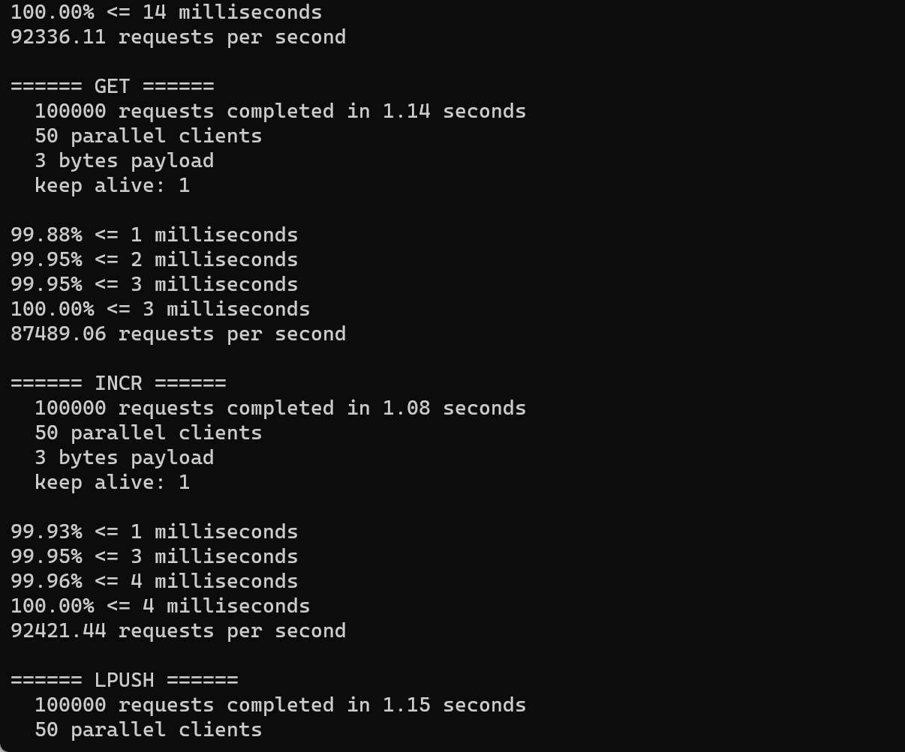

# Java 实现的简易 Redis 数据库

## 项目概述
这是一个基于 Java 和 Netty 实现的轻量级 Redis 服务器，提供了 Redis 核心数据结构和命令的实现，并支持 AOF，RDB的独立持久化（暂不支持混合模式）。性能可达原版 Redis 的约 80%-90%。

## 已实现功能

### 核心功能
- [x] **Redis 协议实现** - 完整支持 RESP (Redis Serialization Protocol)
- [x] **基于 Netty 的高性能网络服务** - 利用 Netty 的事件驱动模型提供高并发支持
- [x] **数据结构层实现** - 高效内存数据结构的 Java 实现

### 持久化功能
# 持久化功能

## RDB 持久化
- **全量快照**
  - 支持后台非阻塞式保存(bgsave)
  - 采用二进制紧凑格式存储
  - 自动触发条件：
    - 900秒内至少1次修改
    - 300秒内至少10次修改
    - 60秒内至少10000次修改
    - 每小时强制全量备份

- **增量快照**
  - 仅记录被修改的键值对
  - 当修改量>100时自动触发
  - 采用写时复制技术优化内存使用

- **高级特性**
  - 多数据库支持
  - 原子文件替换保证数据安全
  - 启动时自动加载RDB文件

## AOF 持久化
- **同步策略**
  - `ALWAYS`: 每次写入都同步到磁盘
  - `EVERYSEC`: 每秒同步一次（默认）
  - `NO`: 由操作系统决定同步时机

- **核心优化**
  - 双缓冲异步写入
  - 命令日志采用RESP协议格式
  - 启动时自动从AOF文件恢复数据

### 数据结构与命令

#### 字符串 (String)
- [x] `SET key value [EX seconds] [PX milliseconds] [NX|XX]` - 设置键值对
- [x] `GET key` - 获取指定键的值
- [x] `DEL key` - 删除指定键值对
- [x] `EXISTS key` - 检查键是否存在
- [x] `EXPIRE key seconds` - 设置键的过期时间
- [x] `TTL key` - 获取键的剩余过期时间
- [x] `INCR key` - 将键的整数值加一
- [x] `MSET key value [key value ...]` - 设置多个键值对

#### 集合 (Set)
- [x] `SADD key member [member ...]` - 添加一个或多个成员到集合
- [x] `SMEMBERS key` - 获取集合中的所有成员
- [x] `SISMEMBER key member` - 判断成员是否在集合中
- [x] `SCARD key` - 获取集合中的成员数量
- [x] `SREM key member [member ...]` - 移除集合中的一个或多个成员
- [x] `SPOP key [count]` - 随机移除并返回集合中的一个或多个成员

#### 哈希表 (Hash)
- [x] `HSET key field value [field value ...]` - 设置哈希表中的字段值
- [x] `HGET key field` - 获取哈希表中指定字段的值
- [x] `HMSET key field value [field value ...]` - 同时设置多个字段值
- [x] `HMGET key field [field ...]` - 同时获取多个字段的值
- [x] `HGETALL key` - 获取哈希表中所有的字段和值
- [x] `HDEL key field [field ...]` - 删除哈希表中的一个或多个字段
- [x] `HEXISTS key field` - 判断哈希表中是否存在指定字段
- [x] `HLEN key` - 获取哈希表中字段的数量

#### 列表 (List)
- [x] `LPUSH key element [element ...]` - 将一个或多个元素添加到列表头部
- [x] `RPUSH key element [element ...]` - 将一个或多个元素添加到列表尾部
- [x] `LPOP key` - 移除并返回列表的第一个元素
- [x] `RPOP key` - 移除并返回列表的最后一个元素
- [x] `LLEN key` - 获取列表的长度
- [x] `LRANGE key start stop` - 获取列表指定范围内的元素
- [x] `LREM key count value` - 移除列表中与值匹配的元素

#### 有序集合 (Sorted Set)
- [x] `ZADD key score member [score member ...]` - 添加一个或多个成员到有序集合
- [x] `ZRANGE key start stop [WITHSCORES]` - 按索引范围获取有序集合的成员
- [x] `ZREVRANGE key start stop [WITHSCORES]` - 按索引范围倒序获取有序集合的成员
- [x] `ZRANGEBYSCORE key min max [WITHSCORES]` - 按分数范围获取有序集合的成员
- [x] `ZREM key member [member ...]` - 移除有序集合中的一个或多个成员
- [x] `ZCARD key` - 获取有序集合的成员数量
- [x] `ZSCORE key member` - 获取有序集合成员的分数

## 性能优化
- 初期尝试使用数组+CRC16作为哈希槽，但经测试性能不及 ConcurrentHashMap
- 采用双缓冲技术提高 AOF 持久化性能
- 通过批处理和异步写入减少 I/O 操作对性能的影响
- 针对高并发场景优化了日志输出频率

## 未来计划
- [ ] 主从复制功能
- [ ] 分片集群支持
- [ ] 事务支持

